# Task 3 - Frontend Setup Guide
Overview:
    This guide will help you set up the React 19 + TypeScript + Ant Design frontend for the Task Execution Manager.

# What we build?
A modern, accessible web UI with:

        React 19 - Latest React version
        TypeScript - Type-safe code
        Ant Design - Enterprise-grade UI components
        Vite - Fast build tool
        Full CRUD Operations - Create, Read, Update, Delete
        Task Execution - Execute and view output
        Search Functionality - Find tasks by name
        Responsive Design - Works on all screen sizes
        Accessibility - WCAG compliant

# Directory Structure
task-manager-ui/
├── node_modules/          
├── public/                
├── src/
│   ├── App.tsx           
│   ├── App.css           
│   ├── main.tsx          
│   ├── index.css         
│   └── vite-env.d.ts     
├── index.html            
├── package.json          
├── tsconfig.json         
├── tsconfig.node.json    
├── vite.config.ts        
└── README.md             

# Prerequisites
Required Software:
    node --version  # Should be v18.0.0 or higher
    npm --version   # Should be v9.0.0 or higher

    # If not installed:
    # macOS: brew install node

Backend Running
Make sure your backend is running:
    # From task-api directory
    kubectl get pods
    # Both mongodb and task-api should be Running

    # Test backend
    curl http://localhost:30080/tasks
    # Should return: []

    # Install all dependencies (this takes 2-3 minutes)
    npm install

***IGNORE***
    package.json

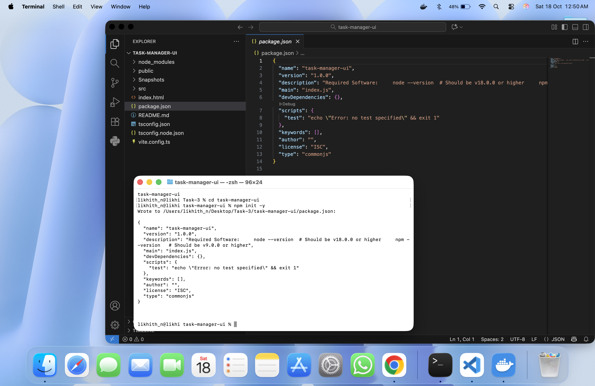

    npm install --save-dev @types/node

***

# Verify installation
ls node_modules
#Should see: react, react-dom, antd, typescript, vite, etc.

# Start Development Server
#Start the dev server
npm run dev

Expected output:
    VITE v5.0.8  ready in 500 ms
    ➜  Local:   http://localhost:3000/
    ➜  Network: use --host to expose
    ➜  press h + enter to show help

# Open in Browser:
    # Open your browser to:
    http://localhost:3000

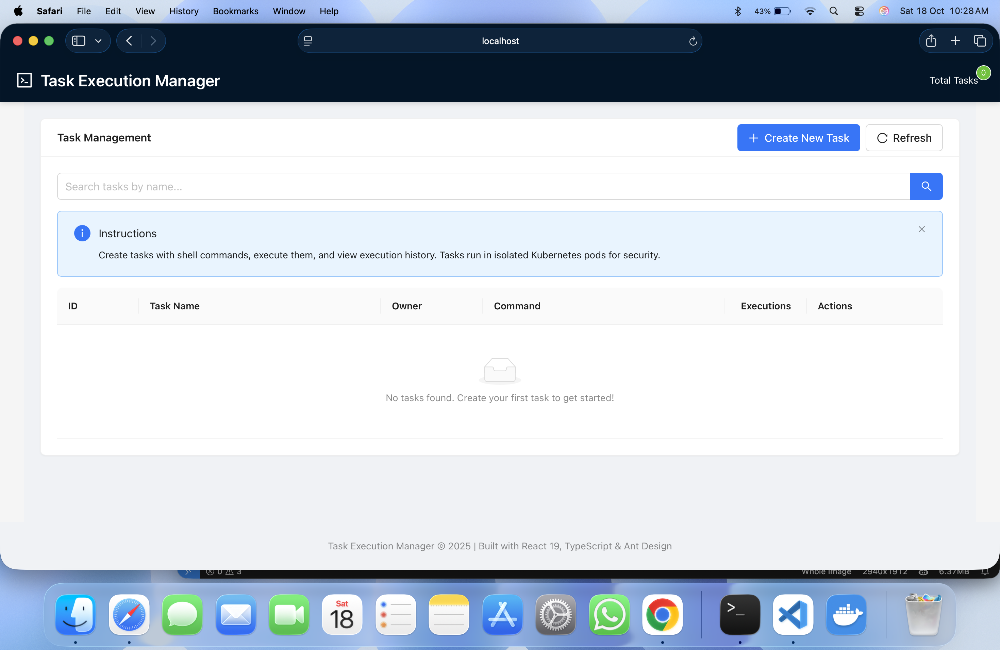

# Testing
# Test1: Create a Task
    1. Click "Create New Task" button
    2. Fill in the form:

        ID: test-1
        Name: Test Task
        Owner: Your Name
        Command: echo Hello World

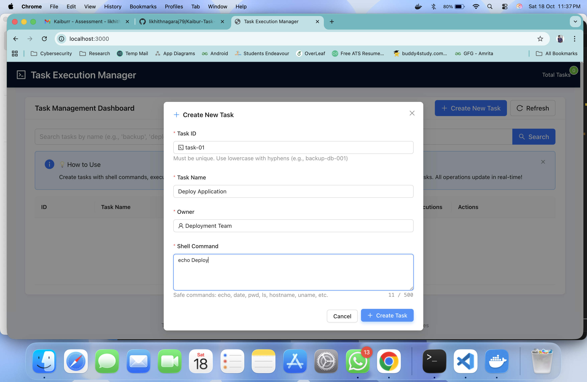

    3. Click "Create Task"

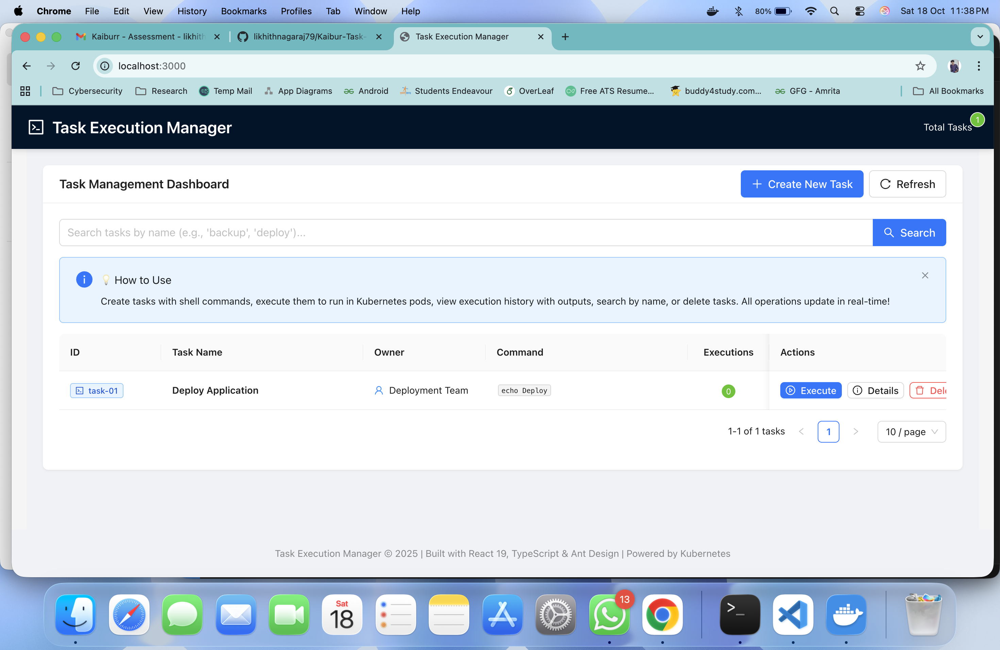

# Test2: Execute a Task
    1. Find your task in the table

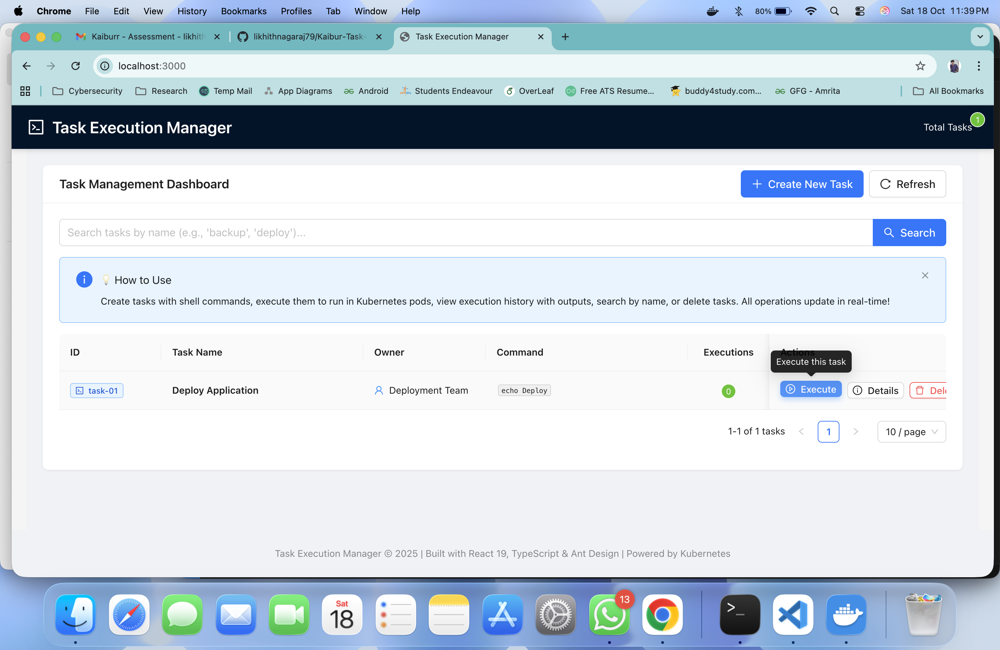

    2. Click "Execute" button

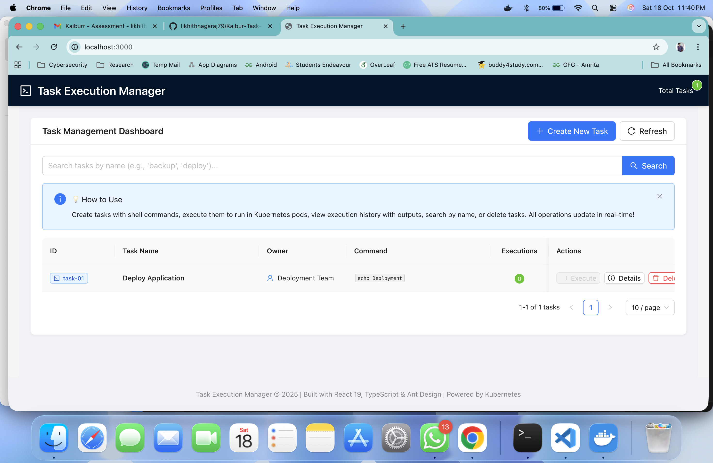

    3. Wait 2-3 seconds

# Test3: View Execution History
    1. Click "Details" button on your task

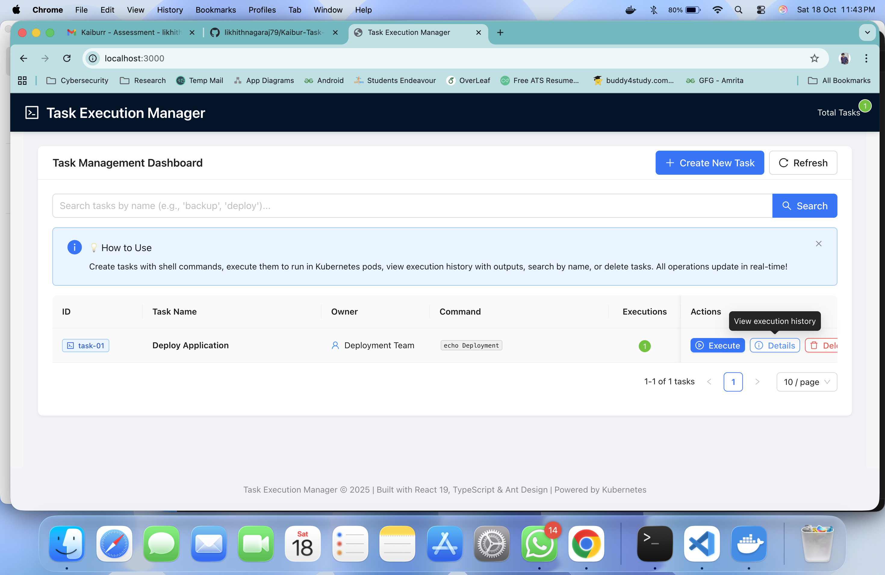

    2. Modal opens showing execution history
            You should see:
                    Start/End times
                    Duration
                    Output: "Deployment"

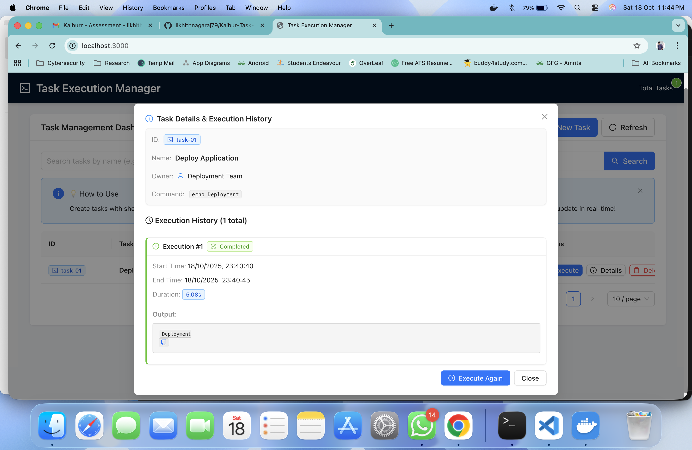

# Test4: Search
#Tasks in Task Manager

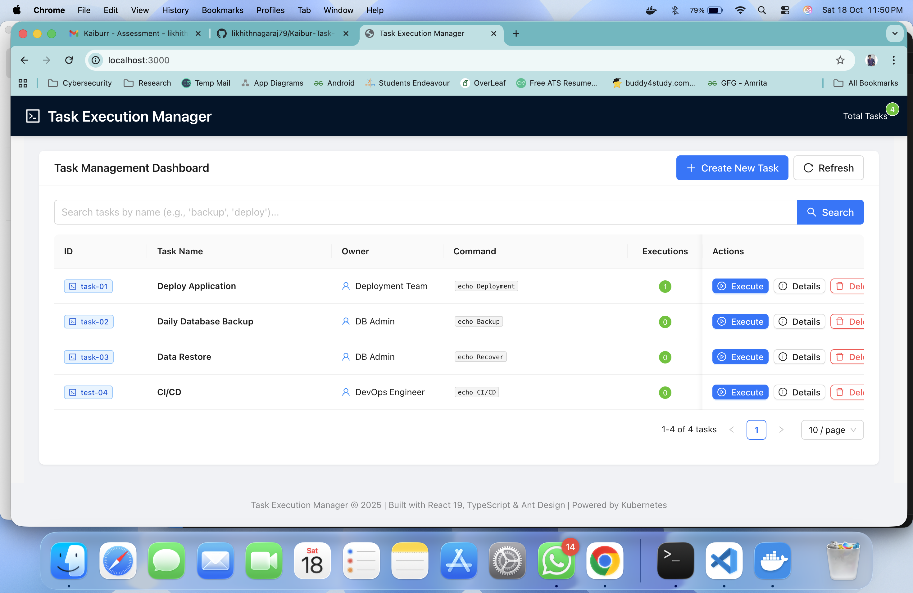

    1. Type task name in search bar
    2. Press Enter or click search icon
    3. Table filters to matching tasks

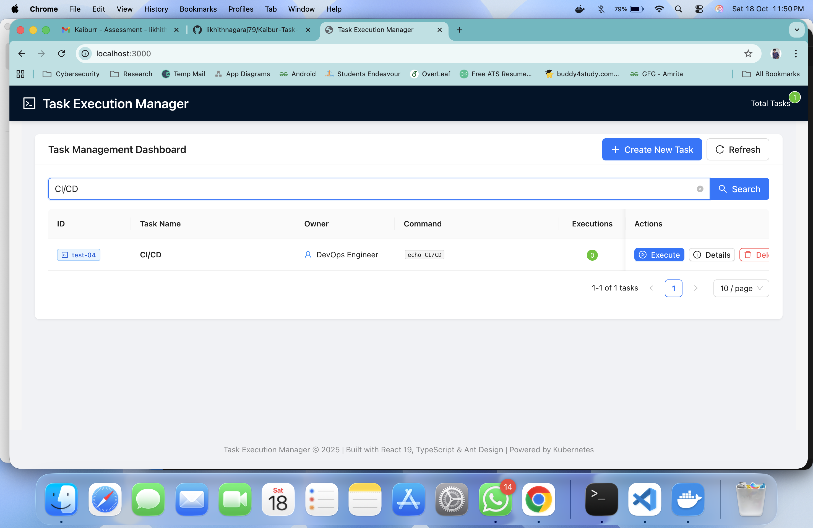

# Test5: Delete
    1. Click "Delete" (trash icon) button

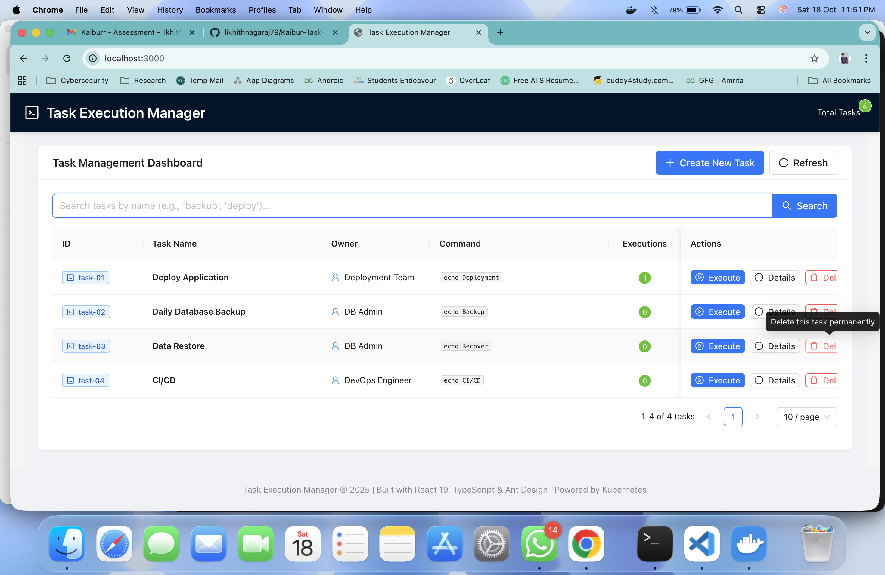

    2. Confirm deletion

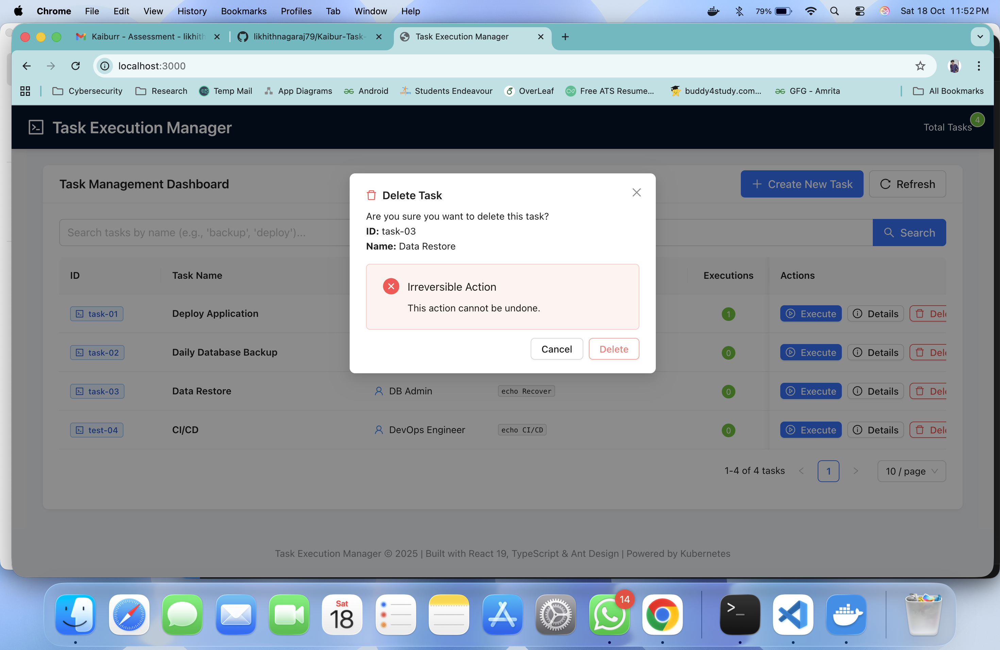

    3. Task disappears from table

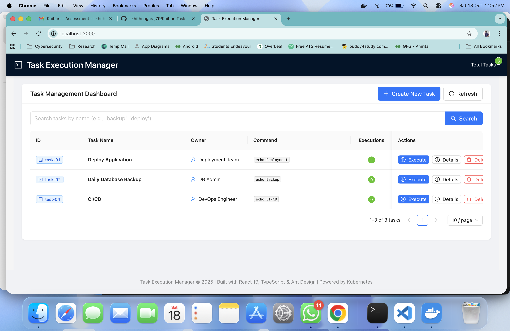